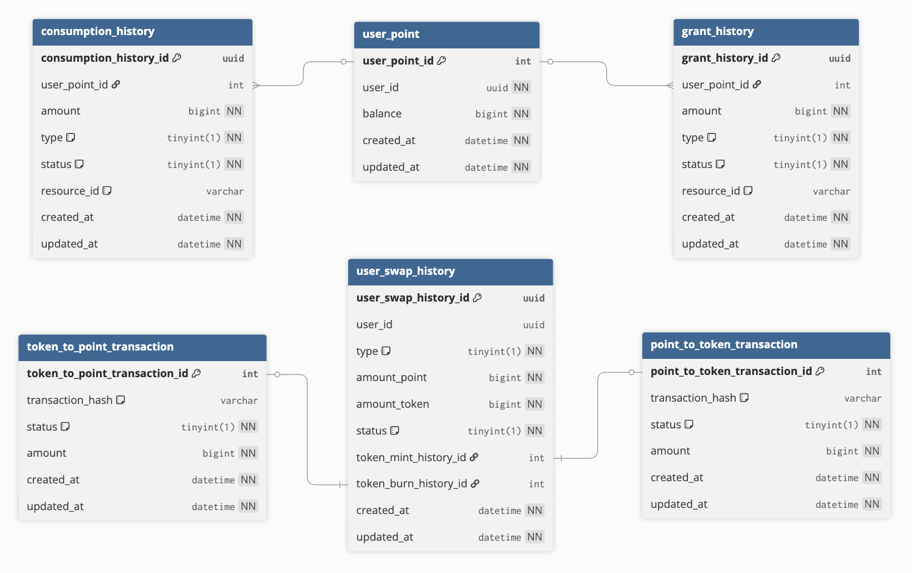
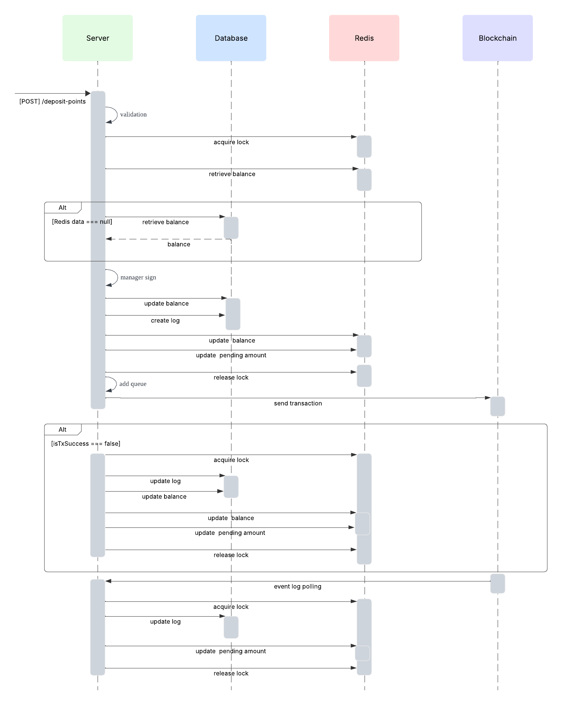
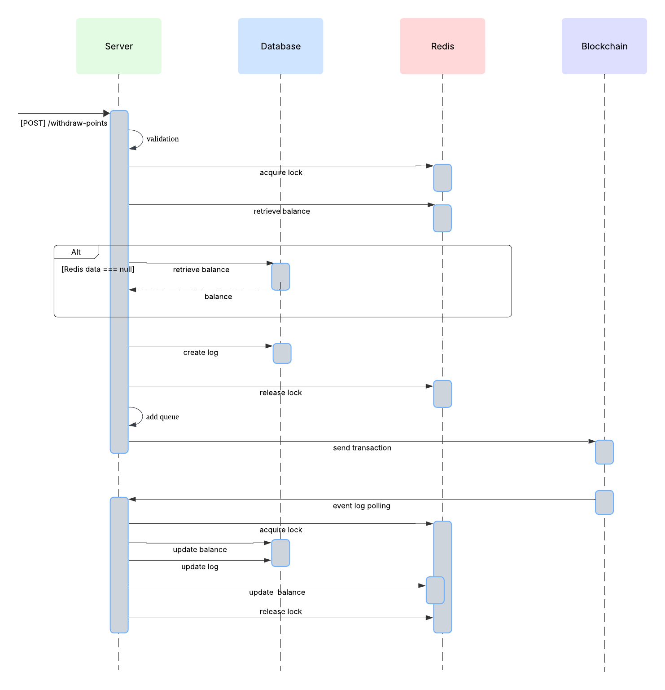
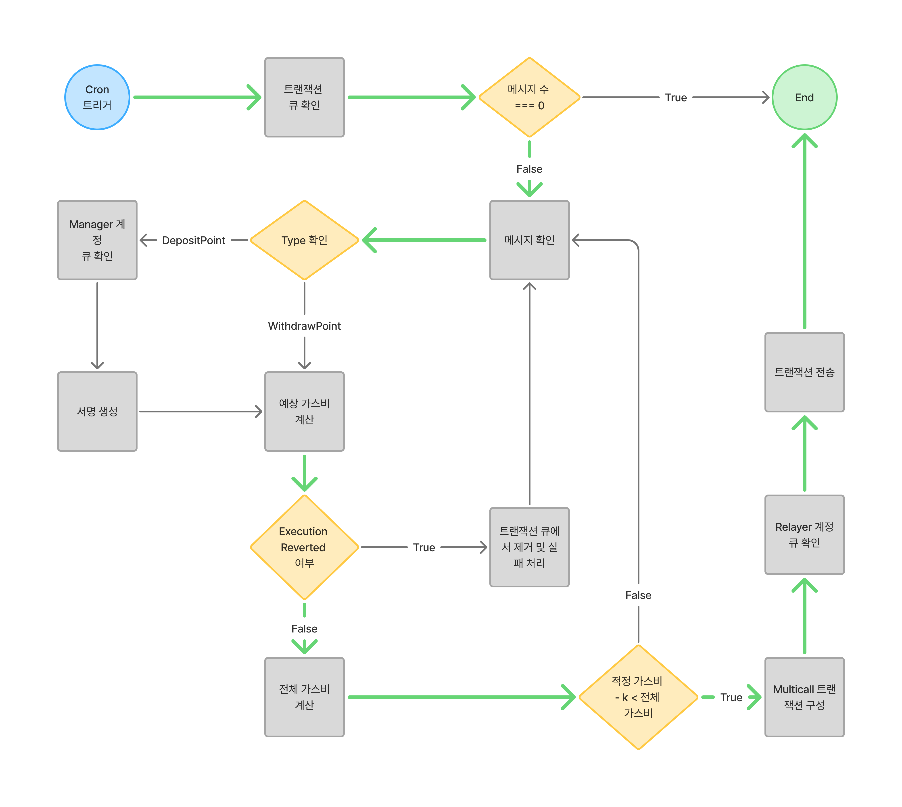

# 블록체인 기반 재화 교환 서비스

## 개요

본 프로젝트는 Web2 기반의 포인트 재화와 블록체인 기반의 거버넌스 토큰을 연결하는 재화 교환 서비스입니다. 사용자는 포인트를 획득하고 소비할 수 있으며, 고정 비율로 블록체인 토큰과 교환할 수 있습니다. 전체 시스템은 Docker Compose를 통해 구성되어 있으며, Frontend(Next.js), Backend(NestJS), Blockchain(Hardhat), Database(PostgreSQL), Cache(Redis), Message Queue(RabbitMQ)로 구성됩니다.

## 프로젝트 세팅 가이드

### 사전 준비 사항

- Docker Desktop 설치 (Compose V2 지원)
- 브라우저 확장 프로그램 MetaMask 설치
- 환경변수 파일 `.env` 생성 필요

### 주의 사항

- 같은 환경 변수(ethereum 계정)로 프로젝트를 동시에 실행하면 nonce 충돌로 인한 오류가 발생할 수 있습니다.

### 환경변수 설정

프로젝트 루트의 `.env.example` 파일을 복사하여 `.env` 파일을 생성하고 다음 환경변수를 설정합니다:

```bash
cp .env.example .env
```

### 컨트랙트 배포 및 세팅

컨트랙트 배포 및 설정에 대한 자세한 내용은 [컨트랙트 설정 가이드](./CONTRACT_SETTING_GUIDE.md)를 참고하세요.

### Docker Compose 실행

1. **전체 서비스 시작**
```bash
docker compose up -d
```

2. **로그 확인**
```bash
# 전체 서비스 로그
docker compose logs -f

# 특정 서비스 로그
docker compose logs -f frontend
docker compose logs -f backend
docker compose logs -f blockchain
```

3. **서비스 중지**
```bash
# 전체 서비스 중지
docker compose down

# 볼륨까지 삭제
docker compose down -v
```

### 서비스 접근 정보

| 서비스 | 포트 | 접근 URL |
|--------|------|----------|
| Frontend | 3000 | http://localhost:3000 |
| Backend | 3001 | http://localhost:3001 |
| Blockchain | 8545 | http://localhost:8545 |
| PostgreSQL | 5432 | localhost:5432 |
| RabbitMQ (AMQP) | 5672 | localhost:5672 |
| RabbitMQ (Management) | 15672 | http://localhost:15672 |

### 헬스체크

모든 서비스가 정상적으로 실행되고 있는지 확인합니다:

```bash
# 서비스 상태 확인
docker compose ps

# 헬스체크 상태 확인
docker compose exec backend curl http://localhost:3000/health
```

## 프로젝트 실행 가이드

### 빌드 및 실행 시간
- 약 3분의 컴파일 및 빌드 시간이 소요됩니다 (네트워크 상황에 따라 상이함)

### 실행 확인 절차
1. **Blockchain 컨테이너 상태 확인**
   ```bash
   docker compose logs -f blockchain
   ```
   - 포인트 서버에 요청한 헬스 체크 성공 여부를 확인합니다
      ```bash
      blockchain  | 🔍 헬스체크 시도 3/36...
      blockchain  | ✅ Point Server 헬스체크 성공!
      blockchain  | 📊 응답 상태: 200
      blockchain  | 📋 응답 데이터: {
      blockchain  |   status: 'ok',
      blockchain  |   timestamp: '2025-07-24T07:56:07.959Z',
      blockchain  |   service: 'Point Server API'
      blockchain  | }
      ```
   - 컨트랙트 이벤트 조회 기능 정상 작동 여부를 확인합니다
      ```bash
      blockchain  | ⏰ 2025-07-24T07:53:17.439Z - 새로운 블록 감지
      blockchain  | 🔍 이벤트 조회 중... 블록 범위: 28787653 - 28787654
      blockchain  | 📊 발견된 이벤트: PointDeposited(0), PointWithdrawn(0), ValidUserSet(0)
      blockchain  | ✅ 블록 28787654까지 처리 완료
      ```

2. **웹 애플리케이션 접속**
   - 크롬 브라우저를 통해 [localhost:3000](http://localhost:3000)으로 접속합니다
   - 처음 페이지 진입 시 컴파일 작업으로 인한 로딩 시간이 소요됩니다
   - 우측 상단의 지갑 연결 버튼을 클릭하여 지갑을 연결합니다

## 블록체인

### 기술 스택
- **컨트랙트 언어**: Solidity
  - 이더리움 블록체인에서 스마트 컨트랙트를 작성하기 위한 표준 언어
  - 풍부한 문서 및 커뮤니티 지원

- **개발 프레임워크**: Hardhat
  - 이더리움 스마트 컨트랙트의 개발, 테스트, 배포를 효율적으로 처리
  - 로컬 이더리움 네트워크 제공
  - 다양한 플러그인 지원

### 컨트랙트 정보
- **체인**: Base Sepolia
- **컨트랙트 주소**:
  - PointManager: [0xFC0198d7246532E530f80F76B0f1cF2586Eae397](https://sepolia.basescan.org/address/0xFC0198d7246532E530f80F76B0f1cF2586Eae397)
  - BloomToken: [0x47aF3894e57c9075371DB7f5EfC5122B2a6AE65c](https://sepolia.basescan.org/address/0x47aF3894e57c9075371DB7f5EfC5122B2a6AE65c)

### 주요 기능
- EIP-712 서명 기반 포인트 교환 트랜잭션 실행

### 사용 방법
1. **테스트 코드 실행**
   ```bash
   REPORT_GAS=true npx hardhat test
   ```

2. **컨트랙트 배포**
   ```bash
   npx hardhat run scripts/pointManager.ts --network baseSepolia
   ```
   - BloomToken 컨트랙트 배포 및 토큰 발행까지 실행

3. **포인트 관리 컨트랙트 운영**
   ```bash
   npx hardhat run scripts/pointManager.ts --network baseSepolia
   ```

### 참고 사항
- 서버에 컨트랙트 이벤트 로그를 전달하는 스크립트가 동작합니다


## 서버

### 기술 스택
- **언어**: TypeScript
  - 풍부한 Web3 관련 라이브러리로 이더리움과의 연동이 유리
  - 타입 체크를 통해 휴먼 에러를 줄이는 데 큰 이점 제공

- **프레임워크**: NestJS
  - 모듈 기반 아키텍처와 데코레이터 문법으로 확장성이 뛰어남
  - 일관된 코드 작성 가능

- **데이터베이스**: PostgreSQL

- **메시지 큐**: RabbitMQ
  - 블록체인 트랜잭션 큐 관리
  - 부하 분산

### 테이블 구조


### 주요 로직
- **포인트를 토큰으로 교환**
  

- **토큰을 포인트로 교환**
  

- **큐 기반 트랜잭션 처리**
  

### 서버 특징
- MSA 구조의 시스템에서 포인트 도메인을 담당
- 유저 테이블은 원활한 테스트를 위해 임시로 생성

### 생략된 기능
- 다른 서버와의 통신 및 인증
- 블록체인 계정 보안 관리
- 유실된 블록 정보 복구 처리

## 클라이언트

### 기술 스택
- **언어**: TypeScript
  - 서버 개발과 동일하게 사용하여 코드의 안정성과 가독성 확보

- **프레임워크**: Next.js
  - React 기반 프레임워크
  - 이더리움과 쉽게 연동할 수 있는 다양한 라이브러리 활용 가능

### 주요 특징
- 블록체인 지갑 연동 (MetaMask)
- 포인트 및 토큰 교환 기능
- 실시간 거래 내역 확인

### 생략된 기능
- 인증 관련 기능

## AI 활용 항목

### Blockchain
- 일부 테스트 코드 생성
- 컨트랙트 배포 코드 작성
- 컨트랙트 운용 코드 작성

### Backend
- Entity 정의 코드 생성
- DTO 관련 코드 작성
- Repository 관련 코드 작성
- 단위 테스트 코드 생성

### Frontend
- 대부분의 컴포넌트 및 로직 코드 생성
